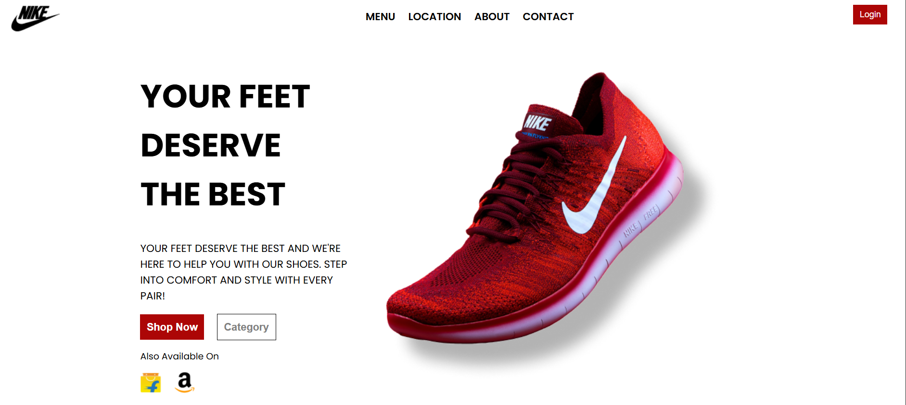

# Brand Page 🚀

A responsive brand landing page built using **React.js**.  
Showcasing elegant design, modern layout, and clean code – perfect for companies, personal brands, or product showcases.

🔗 **Live Demo**: [Nike homepage](https://brand-page-git-main-sujiths-projects-dd9dbe17.vercel.app/)

## 🛠️ Tech Stack

- **React.js**
- **HTML5**
- **CSS3**
- **JavaScript (ES6+)**
- **Vercel** (for deployment)

## 📸 Screenshots



## 🧰 Features

- Fully responsive design
- Clean and structured layout
- Reusable components
- Fast and lightweight

## 🚀 Getting Started

### 1. Clone the repository
```bash
git clone https://github.com/Sujith-1608/Brand-Page.git
cd Brand-Page
```
### 2. Install dependencies
```bash
npm install
```
### 3.  Run the app
```bash
npm start
```
### 4.  Build for production
```bash
npm run build
```

## 📁 Folder Structure
```bash
Brand-Page/
├── public/
├── src/
│   ├── components/
│   ├── assets/
│   ├── App.jsx
│   └── index.css
│   └── main.jsx
├── package.json
└── README.md
```

## 📦 Deployment
Deployed on Vercel – push to main branch and it's live 🚀.

## 📬 Contact
Sujith Reddy Sama
📧 ssujithreddi@gmail.com

##
Give it a ⭐ if you liked the project!
##


